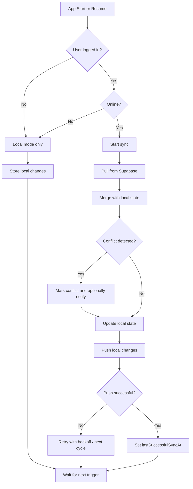

# Synchronization (Supabase)

## Summary

Nimmit is built **offline-first**: the app works with local data first and then synchronizes with Supabase in the background as soon as network connectivity and a valid session are available.  
The core idea is: **always react immediately locally, make remote state consistent later**.

## Planned Synchronization Approach

### 1) Local Single Source of Truth During Usage

- The UI reads/writes directly to the local store (Signals + localStorage).
- Every change immediately creates a new local state including `updatedAt`.
- This keeps the app fully usable even without internet access.

### 2) Synchronization Triggers

Synchronization is started when:

- App start / app resume
- Switching from offline to online
- User action that requires synchronization
- Periodically based on `settings.sync_interval` (from profile)

### 3) Pull-Then-Push Strategy

Each sync cycle follows this pattern:

1. **Pull**: Load server state from Supabase (only data relevant since the last sync)
2. **Merge**: Merge local state with server state
3. **Push**: Write local, not-yet-confirmed changes to Supabase
4. **Checkpoint**: Update `lastSuccessfulSyncAt` locally

This prevents local changes from being overwritten by stale server data.

### 4) Conflict Handling

Recommended baseline principle per record:

- Primary rule: `updated_at` (Last-Write-Wins as a baseline)
- For deletions: soft delete (`deleted_at`) instead of hard delete, so synchronization remains robust
- For real collisions (e.g., two users change the same value while offline):
	- Mark conflict
	- Optional user decision or rule (e.g., server wins / local wins / field-level merge)

Optionally, a conflict notification can be triggered (as planned in the user stories).

### 5) Supabase Roles in the Design

- **Supabase Auth**: identity and session
- **Postgres tables**: persistent list and item state
- **RLS policies**: access only to own or shared lists
- **Realtime (optional)**: faster updates between devices/users without polling

## Data Flow as a Flowchart

